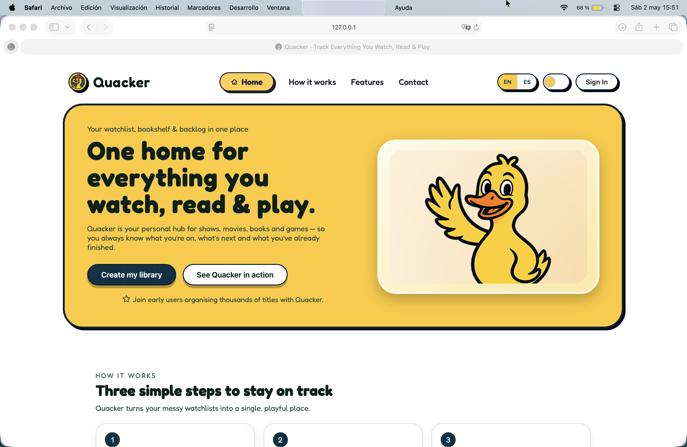
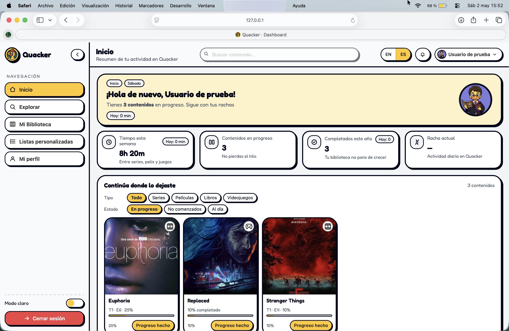
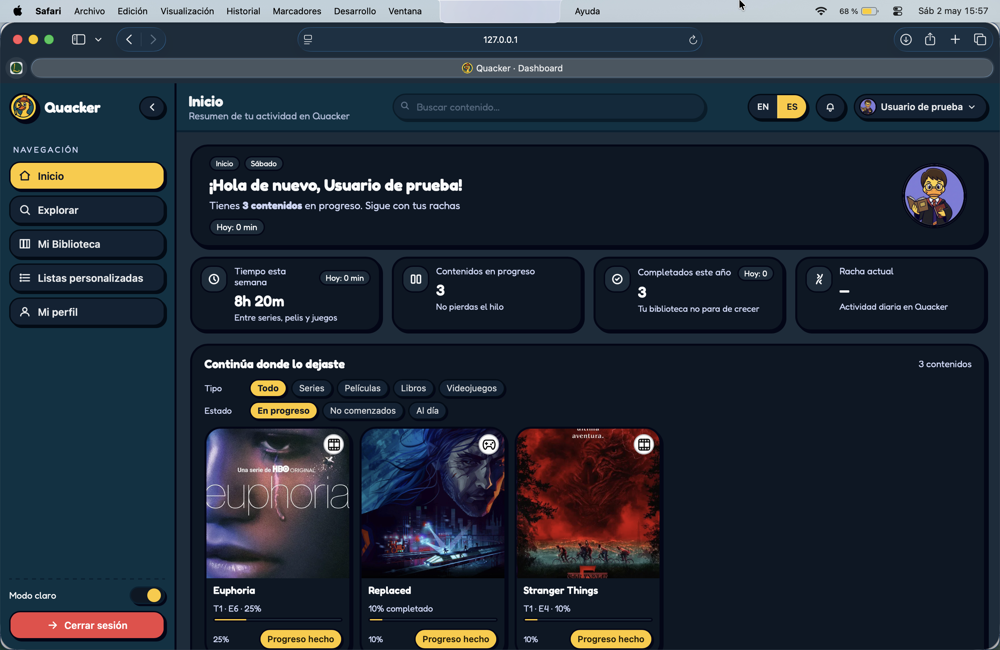
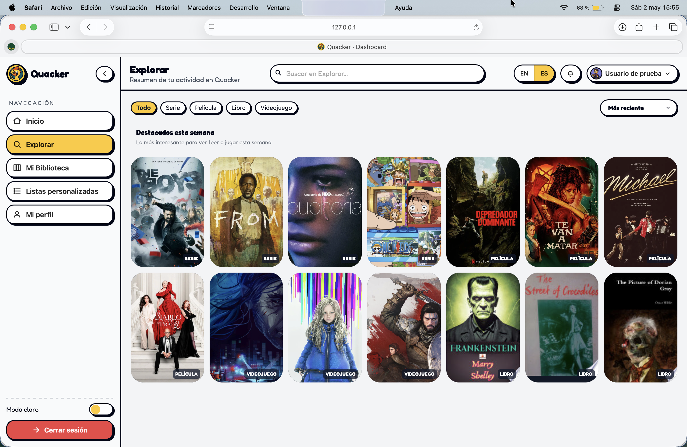
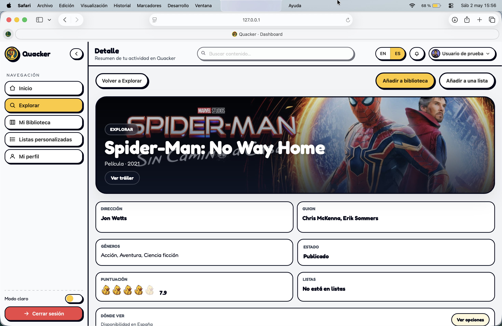
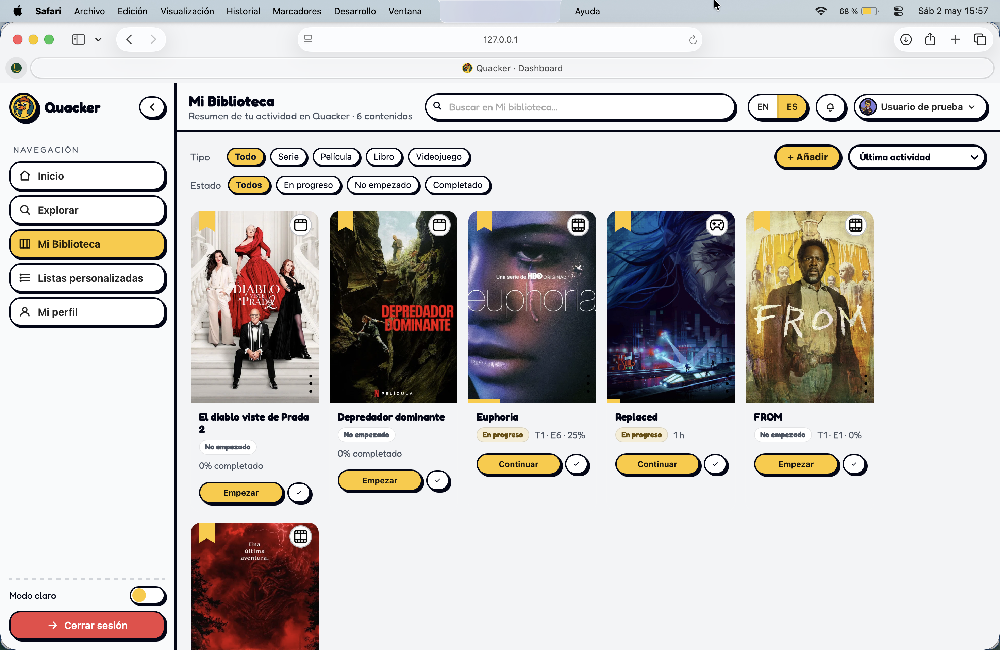
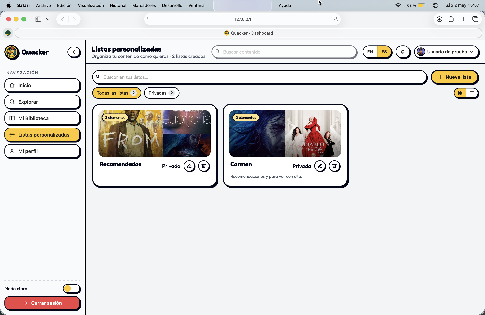

# Quacker

Quacker is a personal entertainment dashboard for tracking movies, TV shows, books, and video games in one place.

It started as a frontend portfolio project and evolved into a full product-style web application with authentication, a custom backend API, persistent data, external content integrations, progress tracking, custom lists, activity history, notifications, and a responsive light/dark interface.

The goal of Quacker is not only to show UI work, but to demonstrate product thinking, frontend architecture, state synchronization, data modeling, and practical execution without relying on a frontend framework.

---

## Product preview

### Landing



### Dashboard





### Explore



### Detail



### Library



### Lists



---

## What Quacker does

Quacker helps users organize their personal entertainment backlog across multiple content types:

- Movies
- TV shows
- Books
- Video games

Users can discover content, save items to their library, track progress, organize custom lists, review recent activity, and manage a basic profile.

---

## Main features

### Public landing page

- Public marketing-style landing page
- Authentication modal
- Light mode and dark mode
- Responsive layout
- Contact section

### Dashboard

- Home dashboard with metrics
- Continue section
- Backlog overview
- Recent activity
- Monthly challenge
- Notification panel
- Profile access
- Language switcher
- Light mode and dark mode

### Explore

- Search and discovery across multiple content sources
- Weekly featured content
- Movies and TV shows from TMDB
- Books from Google Books
- Video games from RAWG
- Type filters and sorting
- Detail preview drawer
- Add to Library
- Add to Lists

### Detail view

- Full detail page for each content item
- Metadata by content type
- Providers for supported movie/show data
- Cast for movies and TV shows
- Seasons and episodes for TV shows
- Related content
- Add to Library
- Add to Lists
- Library/list state synchronization

### Library

- Saved personal content
- Filters by type and status
- Search and sorting
- Progress editing by content type:
  - Movies: not started or completed
  - TV shows: season and episode progress
  - Books: pages read
  - Video games: hours played
- Empty states
- Responsive cards
- Dark mode support

### Lists

- Custom private lists
- Create, edit, and delete lists
- Add saved or discovered content to lists
- List overview in card and list modes
- Visual previews with item covers
- List detail view
- Filters and search inside list detail
- Empty states
- Persistent view mode

### Profile

- Basic profile information
- Avatar selection
- Avatar upload entry point
- Responsive profile layout
- Light and dark mode support

---

## Architecture overview

Quacker is built with vanilla JavaScript using a modular frontend architecture.

There is no React, Vue, Angular, or frontend framework. The UI is rendered manually through DOM updates, feature modules, shared helpers, and global application events.

The architecture focuses on:

- clear frontend/backend boundaries
- modular JavaScript files
- manual DOM rendering
- feature-level state
- global synchronization events
- canonical item identity
- local mode and HTTP mode
- cache invalidation
- progressive product hardening

---

## Tech stack

### Frontend

- HTML
- Custom CSS
- Vanilla JavaScript
- Modular JavaScript files
- Manual DOM rendering
- Responsive design
- Light mode / dark mode
- Basic accessibility patterns

### Backend

- Node.js
- Express
- Cookie-based sessions
- JSON file persistence
- Custom `/api` endpoints
- External API adapters

### External integrations

- TMDB
- Google Books
- RAWG

---

## Key technical decisions

### Vanilla JavaScript architecture

Quacker intentionally avoids frontend frameworks.

This makes the project a stronger demonstration of core frontend skills:

- DOM ownership
- rendering flow
- event handling
- state synchronization
- UI feedback
- module boundaries
- progressive refactoring

### `ApiClient` as a frontend boundary

The frontend communicates with data through a dedicated `ApiClient`.

`ApiClient` handles:

- local mode
- HTTP mode
- backend requests
- session-aware API calls
- library cache
- lists cache
- mutation events
- data normalization

This keeps feature modules from talking directly to backend details.

### Canonical item identity

Content items use a canonical identity based on:

```text
source + externalId
```
Examples:
Examples:

```text
tmdb + 550
google_books + volume-id
rawg + game-id
```

The project also includes identity helpers to resolve item relationships across Explore, Library, Lists, Detail, and Home.

### Event-based synchronization

Quacker uses global custom events such as `quacker:*` to synchronize views after mutations.

This keeps the app usable without a central framework store while still allowing different modules to stay in sync.

Examples of synchronized flows:

- Explore → Library
- Detail → Lists
- Library → Home
- Lists → Detail
- Progress update → Activity feed
- Add/remove item → UI refresh

### Backend persistence

The backend stores user data in `server/db.json`.

This is enough for a local/demo product version and keeps the project easy to run, inspect, and evolve.

For production, this would be replaced by a real database.

---

## Project structure

```text
.
├── index.html
├── dashboard.html
├── README.md
├── CASE_STUDY.md
├── screenshots
├── assets
│   ├── css
│   │   ├── base.css
│   │   ├── landing.css
│   │   └── dashboard.css
│   ├── img
│   └── js
│       ├── app
│       ├── data
│       └── i18n
└── server
    ├── server.js
    ├── adapters
    │   ├── google-books.js
    │   ├── rawg.js
    │   └── tmdb.js
    └── db.json
```

---

## Important frontend modules

Some of the core modules include:

```text
assets/js/data/api-client.js
assets/js/data/item-identity.js
assets/js/app/explore.js
assets/js/app/detail.js
assets/js/app/library.js
assets/js/app/lists.js
assets/js/app/home-lists-ui.js
assets/js/app/home-notifications.js
assets/js/app/monthly-challenges.js
```

These modules separate concerns between data access, identity resolution, feature rendering, user actions, and view synchronization.

---

## Product scope

Quacker v1 focuses on:

- personal entertainment tracking
- content discovery
- library management
- progress tracking
- private custom lists
- activity feedback
- notifications
- responsive UI
- light and dark mode
- portfolio-ready product polish

Some product ideas are intentionally not included in v1:

- public profiles
- collaborative lists
- social features
- payments
- analytics
- production database
- production authentication provider
- recommendation engine

Those are future product directions, not current promises.

---

## Current status

Quacker is in a v1 polish stage.

The core flows are implemented and manually tested:

- Landing
- Authentication modal
- Dashboard
- Explore
- Detail
- Library
- Lists
- List Detail
- Profile
- Notifications
- Progress tracking
- Light mode
- Dark mode
- Mobile responsive layout

A final regression QA pass has been completed for the current v1 scope.

---

## Case study

A full product and engineering case study is available here:

[Read the full case study](CASE_STUDY.md)

It covers architecture, product decisions, trade-offs, QA, external integrations, and future roadmap.

---

## Environment variables

The backend integrations require API keys for external providers.

Create a local `.env` file for development.

Do not commit `.env` or API keys to GitHub.

Expected environment variables include:

```text
TMDB_API_KEY=
GOOGLE_BOOKS_API_KEY=
RAWG_API_KEY=
SESSION_SECRET=
```

Depending on the local configuration, alternative provider variable names may also be supported by the backend adapters.

---

## Running locally

This project uses a Node/Express backend and static frontend files.

Because the exact local scripts may differ depending on the current setup, check the repository scripts before running the app:

```bash
cat package.json
```

Then start the backend using the available script or directly through the server entry point.

The dashboard is designed to work in two modes:

- local/static mode
- HTTP mode through the Express `/api` backend

For the full product experience, use the HTTP backend mode.

---

## Manual QA checklist

Before considering a change complete:

- Check `git status`
- Review `git diff`
- Run the app locally
- Test light mode and dark mode
- Test mobile layout around 393px width
- Check browser console
- Check server console
- Verify no API keys are committed
- Verify no debug logs are left behind
- Test the affected flow end to end

For visual changes, test both desktop and mobile.

For data changes, test Explore, Library, Lists, Detail, and Home synchronization.

---

## Git workflow

The project uses small, focused commits.

Recommended rules:

- one change per commit
- do not mix feature, fix, refactor, and polish
- do not commit broken code
- do not commit `.env`
- do not commit API keys
- do not commit temporary logs
- do not commit commented-out debug code
- test before committing
- review `git diff` before committing
- keep rollback easy

Example commit messages:

```text
fix(lists): stabilize mobile card actions in dark mode
polish(landing): align dark mode content cards
docs: add project README
```

---

## Why this project matters

Quacker is designed as a portfolio-grade product, not just a static demo.

It demonstrates:

- frontend architecture without a framework
- product thinking
- modular JavaScript
- manual rendering discipline
- API boundary design
- state synchronization
- identity modeling
- responsive UI work
- dark mode implementation
- external API integration
- iterative QA and product hardening

The project shows the ability to design, build, debug, polish, and stabilize a real web product from idea to v1.

---

## Future roadmap

Post-v1 ideas include:

- stronger profile settings
- persistent user preferences
- production database
- production authentication
- onboarding
- recommendation logic
- import flows from external services
- analytics
- shared lists
- public profile pages
- social features
- deployment hardening
- SaaS validation

These are intentionally treated as future iterations after the v1 portfolio version is stable.

---

## Author

Built by Paula Asensio as a portfolio-first product project focused on frontend engineering, product design, and SaaS-oriented execution.